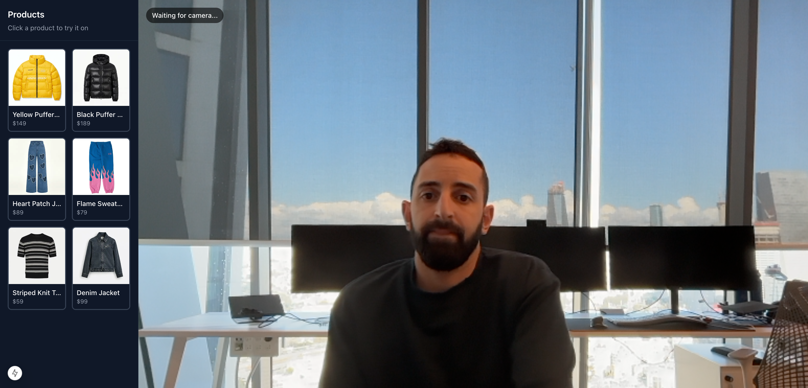

# Standalone Virtual Try-On

> A dedicated try-on experience - products on the left, live camera in the center. Click a product to try it on.

The camera connects automatically on page load. Users click garments from a sidebar to see themselves wearing each item in real-time.



---

## Quick start

### 1. Install dependencies

```bash
cd examples/standalone
npm install
```

### 2. Set your API key

```bash
cp .env.example .env.local
```

Open `.env.local` and add your Decart API key:

```env
DECART_API_KEY=sk_your_key_here
```

> **Tip:** Get your API key from [platform.decart.ai](https://platform.decart.ai). See the [Authentication guide](https://docs.platform.decart.ai/getting-started/authentication) for details.

### 3. Start the dev server

```bash
npm run dev
```

Open [http://localhost:3000](http://localhost:3000). Your camera will start automatically. Click any product from the left sidebar to try it on.

---

## How it works

```
Page loads
  → Camera starts automatically (getUserMedia)
    → Fetch client token from /api/tokens
      → Connect to Decart's lucy_2_rt model (WebRTC)
        → User sees themselves in the live video feed
          → User clicks a product
            → setImage(garment, prompt) sends the garment to the model
              → AI video stream shows the user wearing the garment
                → Click another product to switch instantly
```

When a product is clicked, it calls `setImage()` with the garment:

```typescript
const handleSelectProduct = async (product: Product) => {
  // Load and resize the garment image
  const blob = await urlToImageBlob(product.image);
  const resized = await resizeImageBlob(blob);

  // Apply the garment - no reconnection needed
  clientRef.current.setImage(resized, {
    prompt: product.prompt,
    enhance: false,
  });
};
```

---

## Customization

### Add your own products

Edit `lib/products.ts`. Each product needs a name, image path, prompt, and price:

```typescript
{
  name: "Striped Polo",
  image: "/products/striped-polo.jpg",
  prompt: "Substitute the current top with a navy and white striped polo shirt with a slim fit",
  price: 45,
}
```

Place the garment image in `public/products/`. Use a clean image of just the garment on a white background for best results.

### Use enhance-prompt for user-uploaded images

If your app accepts user-uploaded garment images, use the enhance-prompt API instead of hardcoded prompts:

```typescript
const formData = new FormData();
formData.append("image", userUploadedFile);

const res = await fetch("/api/enhance-prompt", {
  method: "POST",
  body: formData,
});
const { prompt } = await res.json();

// Use the generated prompt with setImage()
clientRef.current.setImage(resizedBlob, { prompt, enhance: false });
```

Requires `OPENAI_API_KEY` in `.env.local`.

### Adapt to your stack

This example uses Next.js + Tailwind, but the core Decart integration works with any React framework. The key files to port:

1. **`app/api/tokens/route.ts`** - adapt to your backend (Express, Fastify, etc.)
2. **`hooks/useDecartRealtime.ts`** - works in any React app as-is
3. **`hooks/useCamera.ts`** - works in any React app as-is

---

## Environment variables

| Variable | Required | Purpose |
|----------|----------|---------|
| `DECART_API_KEY` | Yes | Creates client tokens for realtime connections |
| `OPENAI_API_KEY` | No | Powers `/api/enhance-prompt` for auto-generating prompts |
